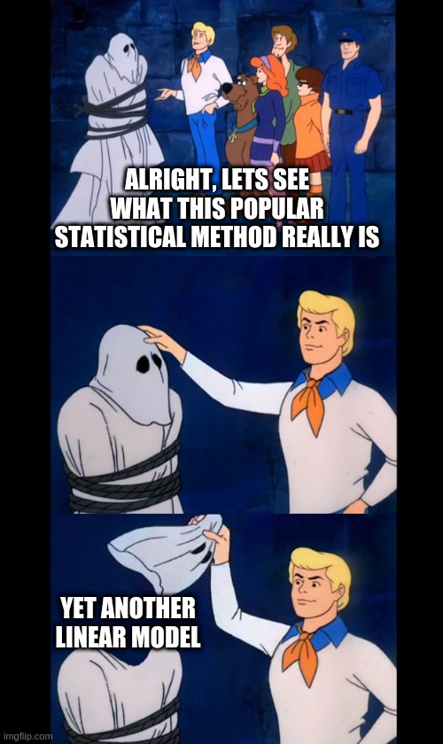

# Linear Models - Emma {#linear}

## Introduction

At this point, you are likely familiar with linear regression. As discussed before, linear regression models are a special case of generalized regression model that we use when the data are normally distributed and have constant variance. We can think of linear regression models in the same terms we think of other regression models.

The two components of a regression model are the random component and the systematic component and for linear regression,

$$
\begin{cases}
  \text{var}[y_i] = \sigma^2/w_i \\
  \mu_i = \beta_0 + \sum_{j=1}^{p}\beta_jx_{ji}
\end{cases}
$$

where $w_i$ are prior weights and $w_i$ and $\text{E}[y_i] = \mu_i$ are known.

When our linear regression has two $\beta_j$ coefficients and the systematic compnent looks like $\mu = \beta_0 + \beta_1x_1$, it is called *simple linear regression*. If we have more than two $\beta_j$ coefficients, our regression model is called *multiple linear regression model* or *multiple regression model*.

When all prior weights $w_i$ are equal to one, our regression model is refered to as *ordinary linear regression model* as opposed to when our prior weights $w_i$ have values other than one and is called a *weighted linear regression model*. 

As mentioned before, the assumptions belonging to linear regression are:

1. The relationship between $\mu$ and each explanatory variable is **linear**.
2. The unexplained variation in our response is constant, otherwise known as **constant variance**.
3. Each datam is **independent** of all other data points. 

